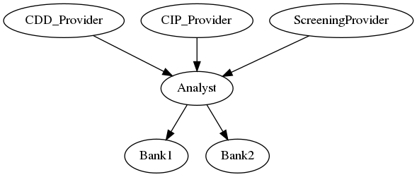

# Reference Application: KYC Data Service

## Overview

This application demonstrates the lifecycle of KYC (Know Your Customer) data subscriptions.
Financial institutions can acquire licenses to subscribe to data streams, periodically receiving tailored research on their customer.
The research is configurable, and the institution can select the components of interest to include in the research, which is
then verified both by a reviewer and by quality assurance.
Until the license expires, they can observe live data streaming or report issues such as performance outage or stale data streams.

## Getting Started

### Installing

**Disclaimer:** This reference application is intended to demonstrate the capabilities of DAML. We recommend that you consider other non-functional aspects, such as security, resiliency, recoverability, etc., prior to production use.

#### Prerequisites

Be sure you have the following installed:
- [DAML SDK](https://docs.daml.com/)
- Java
- Maven
- Make

#### Build the App

Type:
```shell
make build
```
**Note:** If you change the DAML models locally, you need to re-run this command before starting the application.

### Starting the App

**Note:** Make sure you have built the application (see: [Build the App](#build-the-app)).

These commands start the application with wall clock time. Note that Navigator's time widget won't work in this mode as one cannot modify the time.
1. Start the DAML Sandbox and Navigator. Type:
    ```shell
    daml start --sandbox-option --address=localhost --sandbox-option -w
    ```
    The navigator will automatically open in new browser tab at http://localhost:7500.
2. Start the automation logic (triggers). Type:
    ```shell
    scripts/startTriggers.sh localhost 6865 target/know-your-customer.dar target/know-your-customer-triggers.dar
    ```

### Stopping the App

1. Stop the triggers by typing **Ctrl+C**.
1. Stop the Sandbox and the Navigator by typing **Ctrl+C** in the DAML assistant.

### Resetting the Prototype

Reset the application by following these steps:
1.  Stop the app by following the steps in [Stopping the App](#stopping-the-app) section.
2.  Start the app by following the steps in [Starting the App](#starting-the-app) section.

## Working with DAML Hub

1. As a first step, build the whole project:
```
make clean build
```

2. Start a new project at DAML Hub. Upload the DARs to DAML Hub (in your new project, Deployments tab / Upload file, two files `target/know-your-customer*.dar`), deploy the model (know-your-customer.dar, Deploy Instance).

3. Add the parties to the DAML Hub project:
    - CIP_Provider
    - CDD_Provider
    - ScreeningProvider
    - KYC_Analyst
    - KYC_Reviewer
    - KYC_QA
    - Bank1
    - Bank2
    - Operator

4. Download the following files:
    - `participants.json` (Ledger settings tab)
    - `parties.json` (Users tab)

5. Run the market setup:
```
daml script \
  --participant-config participants.json \
  --json-api \
  --dar target/know-your-customer.dar \
  --script-name DA.RefApps.KnowYourCustomer.MarketSetupScript:setupMarketWithDablParties \
  --input-file parties.json
```

6. Run the triggers from the DAML Hub UI:
```
CIP_Provider:
DA.RefApps.KnowYourCustomer.Triggers.AutoProposeAndAccept:autoProposeTrigger
DA.RefApps.KnowYourCustomer.Triggers.AutoRegisterLicense:automaticLicenseRegistrarTrigger
DA.RefApps.KnowYourCustomer.Triggers.Publisher:cipTrigger

CDD_Provider:
DA.RefApps.KnowYourCustomer.Triggers.AutoProposeAndAccept:autoProposeTrigger
DA.RefApps.KnowYourCustomer.Triggers.AutoRegisterLicense:automaticLicenseRegistrarTrigger
DA.RefApps.KnowYourCustomer.Triggers.Publisher:cddTrigger

ScreeningProvider:
DA.RefApps.KnowYourCustomer.Triggers.AutoProposeAndAccept:autoProposeTrigger
DA.RefApps.KnowYourCustomer.Triggers.AutoRegisterLicense:automaticLicenseRegistrarTrigger
DA.RefApps.KnowYourCustomer.Triggers.Publisher:screeningTrigger

KYC_Analyst:
DA.RefApps.KnowYourCustomer.Triggers.AutoProposeAndAccept:autoAcceptTrigger
DA.RefApps.KnowYourCustomer.Triggers.AutoStartResearch:autoStartResearchProcessTrigger
DA.RefApps.KnowYourCustomer.Triggers.MergeAndPublishResearch:mergeAndPublishResearchDataTrigger

KYC_Reviewer:
DA.RefApps.KnowYourCustomer.Triggers.AutoReviewAndVerification:autoReviewTrigger

KYC_QA:
DA.RefApps.KnowYourCustomer.Triggers.AutoReviewAndVerification:autoVerifyTrigger

Operator:
DA.RefApps.KnowYourCustomer.Triggers.TimeUpdater:timeUpdaterTrigger
```


## User Guide

This User Guide will take you step-by-step through the process of subscribing to data streamed by publishers. It will lead you through all the major Navigator screens and data fields that you will need to use.

After working through these steps, you can use the Navigator interface to explore other functionality that is available in the application.

_Note_: This demo is designed to show a successful conclusion of the workflow without exceptions or error conditions. A full production implementation would include additional features, handle errors and exceptions, and incorporate appropriate security controls.

## Workflow

### Roles and Responsibilities

There are two fundamental role categories in the data streaming model: _publisher_ and _consumer_.
The publisher streams some data, observable by its consumers via their licenses. The diagram below shows the publisher-consumer relationships created by the market setup.



|         Role       | Responsibilities
| :----------------: | :---
|       Bank         | Financial institution buying research on their customers. There are two banks: _Bank1_ and _Bank2_.
|       Provider     | Provides raw customer data, initially read from a CSV file. There are three parties in this role: _CDD_Provider_, _CIP_Provider_, and _ScreeningProvider_.
|       Analyst      | Collates raw research data streams, sends them through the review process (_Reviewer_ and _QA_), and publishes the results for the banks.
|       Reviewer     | Can review research composed by the _Analyst_.
|       QA           | The gate keeper before publishing research. In most cases it simply accepts the review done by the _Reviewer_, but occasionally performs additional validation.
|       Operator     | Represents the infrastructure. Operates model clock, builds relationships between parties, etc.

## Running the Application

### Choosing and Changing Roles

When you launch KYC Data Service application, you will see the Navigator screen with the option to choose your role.

To log in:

*   On the home screen, select the party from the list.

To switch users:

1. Click the name of the current party at the top of the screen.
2. On the home screen, select a different party.

*Note*: A convenient way to switch between parties is to open separate browsers, e.g., using a private browsing or incognito window.

### Setting the Model Time

For better interoperability and demo experience, the model time is emulated by contracts on the ledger.
Therefore, the system time (coming from your operating system) and the model time (mainly used to make time-based decisions in the model) are separate concepts, including their speed.
You can observe the model time as any party on the _CurrentTime_ contract.
You will also need to continue/stop/set time as the Operator to follow the demo workflow as described in the steps below.

### Market Setup

The participants listed above in Roles and Responsibilities are added automatically at market setup along with other required reference data.
The publisher-consumer relationships are also set up to ease license issuance.

### Workflow 1: Observation of Preloaded Data Streams

#### Enabling Model Time Progressing

1. Log in as *Operator*.
2. Select the *Time Management* tab.
3. Select the *Time Manager* contract.
4. Select the choice *Continue*.

#### Observing Data Forwarded by KYC_Analyst

1. Log in as *KYC_Analyst*.
2. Select the *Received KYC data* tab (or the *Provided KYC streams* tab).
3. Review the incoming (or outgoing) data that is displayed.
4. Wait 5 seconds.
5. Observe the updated data.
6. (Optional) Check *Include archived* to see previously published data.

#### Observing Data Received by Bank1

1. Log in as *Bank1*.
2. Select the *Received KYC data* tab.
3. Review the incoming data that is displayed.
4. Wait 5 seconds.
5. Observe the updated data.

### Workflow 2: New Data Stream Subscription

#### Requesting Subscription for Bank2

1. Log in as *Bank2*.
2. Select the *Relationships* tab.
3. Select the contract where *My Role* is *KYC data consumer*.
4. Select the choice *RequestStandardAnnualStream*.
5. Fill the customer name: *ACME*.
6. Select all inclusion: *includeCIP*, *includeCDD*, and *includeScreening*.

#### Replying to Subscription with a Proposal

1. Log in as *KYC_Analyst*.
2. Select the *KYC Requests* tab.
3. Select the *Received* *DataStreamRequest* contract.
4. Select the choice *DataStreamRequest_Propose*.
5. Fill the price, e.g.: 100

#### Accepting the Proposal

1. Log in as *Bank2*.
2. Select the *KYC Price Proposals* tab.
3. Select the *Received* *DataLicenseProposal* contract.
4. Select the choice *DataLicenseProposal_Accept*.

The *KYC Licenses* tab shows that the license automatically goes *live* as does the data stream (*Received KYC data* tab).

#### Enabling Model Time Progressing

1. Log in as *Operator*.
2. Select the *Time Management* tab.
3. Select the *Time Manager* contract.
4. Select the choice *Continue*.

#### Observing Data Received by Bank2

1. Log in as *Bank2*.
2. Select the *Received KYC data* tab.
3. Review the incoming data showed.
4. Wait 5 seconds.
5. Observe the updated data.

### Workflow 3: Disputing Data Quality

#### Disabling Model Time Progressing

1. Log in as *Operator*.
2. Select the *Time Management* tab.
3. Select the *Time Manager* contract.
4. Select the choice *Stop*.

#### Recording Data Quality Issue by Bank1

1. Log in as *Bank1*.
2. Select the *Received KYC data* tab.
3. Select the disputed *Publication* contract.
4. Select the choice *DisputeQuality*.
5. Fill the description, e.g.: *The data seems to have issues*

#### Observing Disputes

1. Log in as *KYC_Analyst* or stay logged in as *Bank1*.
2. Select the *Complaints: Data Quality* tab.
3. Review the created complaints.

## Additional Exploration

After completing the workflow, you can explore the application to try other paths or restart with a custom CSV, etc.

CONFIDENTIAL © 2020 Digital Asset (Switzerland) GmbH and/or its affiliates. All rights reserved.
Any unauthorized use, duplication or distribution is strictly prohibited.
